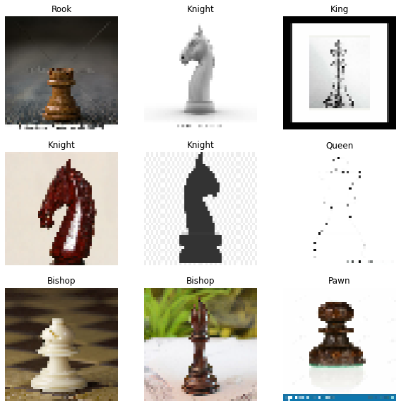
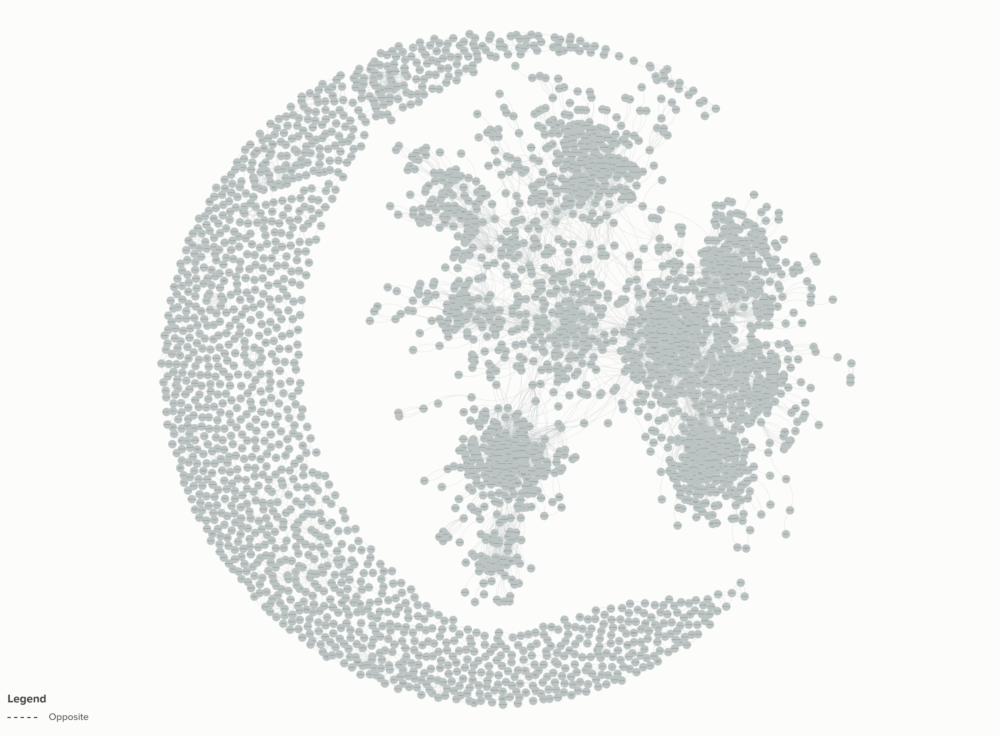

# ml_algorithm

1.chess piece classification using keras

.png)

## Sklearn Network Analysis
[Click here to view the network analysis using sklearn](https://embed.kumu.io/67a4331c2ba5818918f3b093cb449803)

